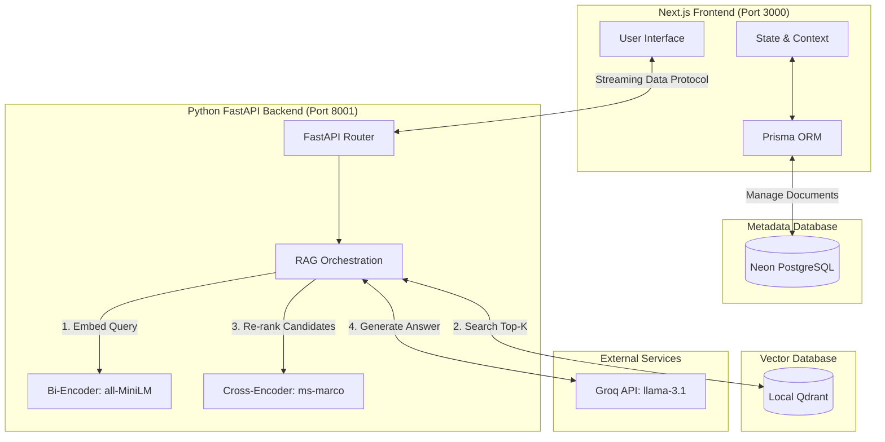
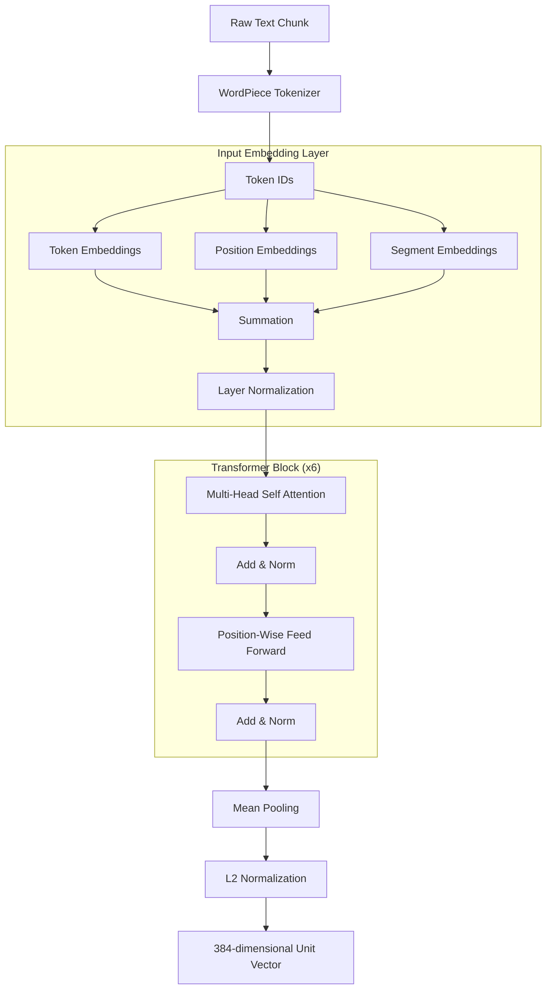
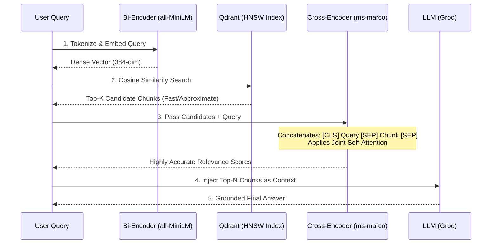

<div align="center">
  <h1>🧠 Synapse RAG</h1>
  <p><strong>Legal Contract Intelligence & Analysis System</strong></p>
  <p><em>Dense Retrieval and Cross-Encoder Re-Ranking with Distilled Transformer Architectures</em></p>
  
  [](https://nextjs.org/)
  [](https://react.dev/)
  [](https://fastapi.tiangolo.com/)
  [](https://www.python.org/)
  [](https://qdrant.tech/)
</div>

<br />

## 📑 Table of Contents

1. [Abstract & Motivation](#-abstract--motivation)
2. [System Architecture](#-system-architecture)
3. [The Deep Learning Pipeline](#-the-deep-learning-pipeline)
   - [Transformer Encoder Architecture](#transformer-encoder-architecture)
   - [Two-Stage Retrieval (Bi-Encoder & Cross-Encoder)](#two-stage-retrieval)
   - [Vector Search with HNSW](#vector-search-with-hnsw)
4. [Dataset & Evaluation](#-dataset--evaluation)
5. [Core Features](#-core-features)
6. [Tech Stack](#-tech-stack)
7. [Getting Started (Local Setup)](#-getting-started-local-setup)
8. [Conclusion & Future Work](#-conclusion--future-work)

---

## 🔬 Abstract & Motivation

Large Language Models (LLMs) have achieved remarkable performance in generative tasks, but their susceptibility to **hallucination** makes them dangerous for high-stakes domains like legal contract analysis. A fabricated clause or misrepresented termination condition could result in severe financial and legal liabilities. 

**Synapse RAG** solves this through a highly optimized **Retrieval-Augmented Generation (RAG)** pipeline. Instead of relying on parametric memory, the system retrieves exact contractual passages from a verified database and bounds the LLM's context exclusively to those passages. 

This project implements a sophisticated **two-stage neural retrieval pipeline**:
1. **O(1) Dense Retrieval:** A distilled bidirectional Transformer (`all-MiniLM-L6-v2`) embedded via HNSW graph index.
2. **O(N) Re-Ranking:** A cross-encoder sequence classifier (`ms-marco-MiniLM-L-6-v2`) that calculates exact query-passage relevance via joint attention.

---

## 🏗️ System Architecture

Synapse RAG employs a decoupled, dual-server architecture separating the dynamic frontend from the compute-intensive machine learning backends.

### The Two-Process Setup



1. **Frontend (Node.js/Next.js 16)**: Handles the UI, state management, citation formatting, and streaming responses (via Vercel AI SDK Data Stream Protocol). It uses Prisma ORM with a PostgreSQL database (Neon) for metadata and relational document management.
2. **Backend (Python/FastAPI)**: Serves as the orchestration layer for the deep learning models. It manages embeddings, cross-encoder re-ranking, similarity search in the **Qdrant** vector database, and the final prompt compilation for the Groq LLM API.

### The Execution Flow

1. **Query Routing**: The user issues a query in either *Single-Document Mode* or *Multi-Document Fan-Out Mode*.
2. **First Stage (Bi-Encoder)**: The query is tokenized via WordPiece and embedded into a 384-dimensional space. The Qdrant engine uses an HNSW index to rapidly retrieve the top $K$ nearest chunks via Cosine Similarity.
3. **Second Stage (Cross-Encoder)**: The retrieved candidates and the original query are concatenated and fed into the Cross-Encoder. The model applies joint attention to output highly accurate relevance logits, re-ranking the chunks to extract the absolute best context.
4. **Generation**: The highest-ranked chunks are injected into a strict system prompt and routed to `llama-3.1-8b-instant` via the Groq API. The response is streamed back to the Next.js frontend with verifiable character-span citations.

---

## 🧠 The Deep Learning Pipeline

This project heavily emphasizes the internal mechanics of the deployed neural networks, ensuring mathematically robust retrieval rather than utilizing opaque "black box" APIs.

### Transformer Encoder Architecture



Both our Bi-Encoder and Cross-Encoder utilize the BERT-based Transformer Encoder architecture, consisting of:

- **Input Embedding Layer**: The sum of Token Embeddings ($V = 30,522$ WordPiece vocab), Position Embeddings (learned sequential patterns up to $N = 512$), and Segment Embeddings. 
- **Multi-Head Self-Attention**: 12 parallel attention heads operating on a 384-dimensional hidden state. This mechanism computes scaled dot-product attention $\text{softmax}(\frac{QK^T}{\sqrt{d_k}})V$, allowing every sub-word token to contextualize itself against the entire legal clause.
- **Position-Wise Feed-Forward Network**: A two-layer MLP with a GELU activation function expanding the dimensionality to 1536 before projecting it back down.
- **Pooling & Normalization**: The outputs are aggregated using Mean Pooling across all tokens and L2 normalized to project the vectors onto a unit hypersphere.

### Two-Stage Retrieval



Why use two models? It is a trade-off between computational complexity and accuracy.

1. **The Bi-Encoder (`all-MiniLM-L6-v2`)**: Operates as a Siamese network. It creates document embeddings independently of queries offline. During inference, it only needs to embed the short query and calculate dot products. It is extremely fast but misses subtle semantic nuances because the query and document cannot attend to each other.
2. **The Cross-Encoder (`ms-marco-MiniLM-L-6-v2`)**: Concatenates the query and the document snippet into a single sequence: `[CLS] Query [SEP] Document [SEP]`. Because self-attention is applied jointly, the model understands exactly how query terms relate to document terms. It is highly accurate but computationally expensive (O(N) for N documents), making it ideal for re-ranking a small candidate pool.

### Vector Search with HNSW

To search through hundreds of thousands of vector embeddings in Qdrant, we utilize **Hierarchical Navigable Small World (HNSW)**. HNSW navigates a multi-layered graph:
- **Top Layers**: Sparse graphs for fast, long-range traversal to identify the general semantic neighborhood.
- **Bottom Layers**: Dense graphs for precise, localized nearest-neighbor calculation. 
This turns a linear $O(N)$ exhaustive search into a sub-linear $O(\log N)$ operation.

---

## 📊 Dataset & Evaluation

Synapse RAG was built against the **LegalBench-RAG** corpus, a curated dataset featuring expert-verified legal QA pairs with exact character-offset ground truths.

**Evaluation Sub-Corpora:**
- **CUAD**: Commercial contracts (clause extraction).
- **ContractNLI**: Non-Disclosure Agreements (hypothesis verification).
- **MAUD**: Mergers & Acquisitions (deal term analysis).
- **PrivacyQA**: Privacy policies.

**Performance Metrics:**
We evaluate retrieval success using Document Retrieval Match (DRM) and character-span Precision/Recall. By employing the Cross-Encoder re-ranker, the system achieves significant improvements in exact passage recall, establishing a robust baseline for legal domain LLM adoption.

**Novelty & Advanced Evaluation (LLM-as-a-Judge):**
Synapse RAG explicitly addresses two major gaps identified in 2024-2025 RAG literature (such as the inability to detect hallucinations end-to-end, and failures in multi-document reasoning highlighted by *Magesh et al.* and *Peng et al.*):
- **End-to-End Faithfulness Evaluation (`scripts/evaluate_faithfulness.py`)**: Addresses the evaluation gap noted by *Pipitone & Alami (2024)* and *Brown et al. (2025)* by testing whether the LLM's final generated answer is strictly supported by the retrieved citations without relying on outside knowledge. It calculates Retrieval Hit Rate, Answer Accuracy, and a strict Faithfulness Score (Hallucination Rate).
- **Multi-Document Reasoning Benchmark (`scripts/evaluate_multidoc.py`)**: Addresses the relational reasoning gap noted by *Li et al. (2025)* and *Kalra et al. (2024)* by testing the system's lightweight `fan_out_retrieve` logic against complex queries requiring cross-contract synthesis, measuring Citation Diversity and Synthesis Accuracy as a performant alternative to expensive GraphRAG approaches.

---

## 🚀 Core Features

- **Multi-Document Fan-Out Retrieval**: Perform comparative analysis across your entire contract repository. The system retrieves and synthesizes information independently per document before final aggregation.
- **Single-Document Deep Dive**: Scope the vector space exclusively to a single selected contract for highly targeted QA.
- **Verifiable Citations**: Total transparency. The LLM's responses include direct UI links to the exact source chunks, backed by the cross-encoder's relevance confidence score.
- **Glassmorphism Dark UI**: A premium, highly responsive user interface built with Tailwind CSS v4 and Framer Motion, delivering real-time streaming tokens with zero latency.

---

## 🛠️ Tech Stack

### Frontend & Metadata
- **Framework**: Next.js 16 (App Router), React 19
- **Styling & UI**: Tailwind CSS v4, shadcn/ui, Framer Motion, Lucide Icons
- **Database (Relational)**: PostgreSQL (via Neon Serverless)
- **ORM**: Prisma v7
- **AI Integration**: Vercel AI SDK v4

### Backend & Machine Learning
- **Server**: Python 3.11, FastAPI, Uvicorn
- **Vector Database**: Qdrant (Local)
- **Embeddings Pipeline**: `sentence-transformers`, LangChain
- **Models**: `all-MiniLM-L6-v2` (Bi-Encoder), `ms-marco-MiniLM-L-6-v2` (Cross-Encoder)
- **LLM**: Groq API (`llama-3.1-8b-instant`)

---

## 💻 Getting Started (Local Setup)

### Prerequisites
- Node.js (v20+)
- Python (v3.10+)
- Groq API Key (for LLM inference)
- Neon Database URL (for Prisma)

### 1. Clone the Repository
```bash
git clone https://github.com/G-450/synapse-rag.git
cd synapse-rag
```

### 2. Frontend Configuration
Install Node dependencies:
```bash
npm install
```

Create a `.env` file in the root directory:
```env
# Frontend Next.js Configuration
PYTHON_BACKEND_URL=http://localhost:8001
DATABASE_URL="your_neon_postgres_connection_string"

# Python Backend Configuration
GROQ_API_KEY="your_groq_api_key_here"
```

Initialize the Prisma schema:
```bash
npx prisma generate
npx prisma db push
```

### 3. Python Backend Configuration
Open a new terminal, navigate to the `python` directory, and set up the virtual environment:
```bash
cd python
python -m venv venv

# Activate on Windows:
venv\Scripts\activate
# Activate on Mac/Linux:
source venv/bin/activate

# Install requirements
pip install -r requirements.txt
```

### 4. Running the Application

You must run both servers concurrently.

**Terminal 1 (Next.js Frontend)**
```bash
# In the root directory
npm run dev
```
*Frontend runs on `http://localhost:3000`*

**Terminal 2 (Python Backend)**
```bash
# In the python/ directory
venv\Scripts\activate
uvicorn app.main:app --port 8001 --reload
```
*Backend runs on `http://localhost:8001`*

### 5. Data Ingestion
To populate the database with the LegalBench-RAG corpus:
```bash
npm run ingest
```
*(Or use the Python equivalent scripts provided in `python/scripts/`)*

---

## 🔮 Conclusion & Future Work

Synapse RAG demonstrates that general-purpose LLMs can be safely applied to high-stakes legal environments when constrained by a rigorous, mathematically sound retrieval pipeline. Future iterations will focus on:
1. **Domain-Adaptive Pretraining (DAPT)**: Fine-tuning the bi-encoder on a massive corpus of unlabelled legal contracts.
2. **ColBERT Implementation**: Exploring late-interaction architectures to bridge the gap between bi-encoder speed and cross-encoder accuracy.
3. **Multi-Modal Document Parsing**: Integrating layout-aware models to handle complex tables and signatures in native PDFs.

---
<div align="center">
  <i>Developed for Capstone Project Review</i>
</div>
