# Synapse RAG: Dense Retrieval and Cross-Encoder Re-Ranking with Distilled Transformer Architectures for Legal Contract Question Answering

> [!NOTE]
> **Architecture Update**: The empirical research and theoretical models described in this paper remain the foundation of Synapse RAG. However, the production implementation has recently been upgraded. The vector storage backend has migrated from **PostgreSQL/pgvector to a local Qdrant instance**, streamlining the Python ingestion process and accelerating HNSW index queries. Furthermore, the system now features a robust decoupled Next.js 16 frontend with real-time streaming and verifiable citation tracking via the Vercel AI SDK.

---

**Abstract**—Retrieval-Augmented Generation (RAG) systems augment Large Language Models with externally retrieved evidence to mitigate hallucination. In high-stakes domains such as legal contract analysis, the fidelity of the retrieval stage is paramount: a failure to surface the correct passage propagates irrecoverably into the generation output. This paper presents a comprehensive deep learning analysis of *Synapse RAG*, a two-stage neural retrieval pipeline designed for the LegalBench-RAG corpus. The first stage employs a distilled bidirectional Transformer encoder (*all-MiniLM-L6-v2*) operating as a **bi-encoder** to project legal text chunks and user queries into a shared 384-dimensional embedding space, indexed via a Hierarchical Navigable Small World (HNSW) graph for sub-linear approximate nearest-neighbor search. The second stage applies a **cross-encoder** (*ms-marco-MiniLM-L-6-v2*), a sequence classification Transformer that jointly attends over concatenated query–passage pairs to produce fine-grained relevance scores for re-ranking. We provide a layer-by-layer architectural decomposition of every neural component—including WordPiece tokenization, three-part input embeddings, multi-head self-attention, position-wise feed-forward networks, knowledge distillation, pooling strategies, and the HNSW index—supported by empirical validation experiments confirming embedding geometry, semantic clustering, contextual sensitivity, and re-ranking effectiveness. Our evaluation on 50 LegalBench-RAG query–answer pairs yields a character-span recall of 60.3% and an F1 of 30.5%, establishing a quantitative baseline for future domain-adaptive improvements.

**Keywords**—Transformer Encoder, Bi-Encoder, Cross-Encoder, Knowledge Distillation, HNSW, Retrieval-Augmented Generation, Sentence Embeddings, Legal NLP, Re-Ranking.

---

## 1. Introduction

### 1.1 Motivation

Large Language Models (LLMs) such as GPT-4, LLaMA, and Gemini have achieved remarkable performance across natural language understanding and generation benchmarks. However, their parametric knowledge is fixed at training time and is susceptible to *hallucination*—the generation of plausible but factually incorrect content [1]. In the legal domain, where accuracy, provenance, and verifiability are non-negotiable requirements, hallucination constitutes a critical failure mode that can have significant legal and financial consequences.

Retrieval-Augmented Generation (RAG) [2] addresses this limitation by prepending retrieved evidentiary passages to the LLM's context window, grounding the generated response in verifiable source material. The quality of the final answer is therefore bounded by the quality of retrieval: if the correct passage is not retrieved, the LLM cannot produce a correct, grounded answer regardless of its generative capabilities.

### 1.2 Research Contributions

This paper makes the following contributions:

1. **Architectural Decomposition**: A layer-by-layer analysis of two distilled Transformer encoders (bi-encoder and cross-encoder), detailing the mathematical formulations and parameter counts for every sublayer—including token embeddings, positional encodings, multi-head self-attention, feed-forward networks, and classification heads.

2. **Empirical Architecture Validation**: A comprehensive test suite comprising 8 experiments that validate embedding dimensionality, L2 normalization, semantic clustering, pooling strategy divergence, cross-encoder ranking accuracy, contextual word sense disambiguation, and embedding space isotropy.

3. **Two-Stage Retrieval Analysis**: A formal treatment of the retrieve-then-rerank paradigm, comparing the computational trade-offs between the O(1)-per-document bi-encoder and the O(N)-per-query cross-encoder, and demonstrating their complementary roles.

4. **Domain-Specific Evaluation**: Quantitative retrieval performance metrics (Precision, Recall, F1, Document Retrieval Match) on the LegalBench-RAG corpus, providing a reproducible baseline for legal domain RAG systems.

### 1.3 Paper Organization

Section 2 formalizes the problem setting. Section 3 presents the complete Transformer encoder architecture. Section 4 details the bi-encoder for dense retrieval. Section 5 describes the cross-encoder for re-ranking. Section 6 covers the HNSW index structure. Section 7 discusses the knowledge distillation process. Section 8 presents our comprehensive experimental validation. Section 9 reports retrieval evaluation results. Section 10 discusses findings and limitations. Section 11 concludes.

---

## 2. Problem Formulation

### 2.1 Task Definition

Given a corpus $\mathcal{C} = \{d_1, d_2, \ldots, d_M\}$ of $M$ legal documents, each document $d_j$ is partitioned into a set of text chunks $\{c_{j,1}, c_{j,2}, \ldots, c_{j,K_j}\}$ via a sliding window chunking strategy. For a user query $q$, the retrieval system must identify the top-$k$ chunks $\{c^*_1, c^*_2, \ldots, c^*_k\}$ that are most semantically relevant to $q$.

### 2.2 Two-Stage Retrieval Formulation

The retrieval process is decomposed into two stages:

**Stage 1 (Bi-Encoder Retrieval)**: Compute dense embeddings independently:

$$\mathbf{q} = f_\theta(q), \quad \mathbf{c}_i = f_\theta(c_i) \quad \forall c_i \in \mathcal{C}$$

where $f_\theta: \mathcal{T} \rightarrow \mathbb{R}^d$ is the bi-encoder mapping text to $d$-dimensional vectors. Retrieve the top-$k'$ candidates by cosine similarity:

$$\text{sim}(\mathbf{q}, \mathbf{c}_i) = \frac{\mathbf{q} \cdot \mathbf{c}_i}{\|\mathbf{q}\| \cdot \|\mathbf{c}_i\|}$$

**Stage 2 (Cross-Encoder Re-Ranking)**: For each candidate $c_i$ in the top-$k'$ set, compute a joint relevance score:

$$s_i = g_\phi([q; c_i])$$

where $g_\phi: \mathcal{T} \times \mathcal{T} \rightarrow \mathbb{R}$ is the cross-encoder that jointly processes the concatenated query–passage pair. Re-rank by $s_i$ and return the top-$k$ ($k < k'$).

### 2.3 Dataset: LegalBench-RAG

The system is evaluated on the **LegalBench-RAG** dataset [3], which provides expert-verified ground truth at the character-span level across four legal sub-corpora:

| Sub-Corpus | Domain | Document Type |
|------------|--------|---------------|
| **CUAD** | Commercial contracts | Clause type extraction |
| **ContractNLI** | Non-Disclosure Agreements | Hypothesis verification |
| **MAUD** | Merger & Acquisition | Deal term analysis |
| **PrivacyQA** | Privacy policies | Policy clause retrieval |

Each query-answer pair includes exact character offsets (`char_start`, `char_end`) within the source document, enabling granular retrieval evaluation beyond document-level matching.

---

## 3. Transformer Encoder Architecture

Both the bi-encoder and cross-encoder are built upon the Transformer encoder architecture [4], specifically the BERT variant [5]. This section provides a complete layer-by-layer decomposition.

### 3.1 Overall Architecture

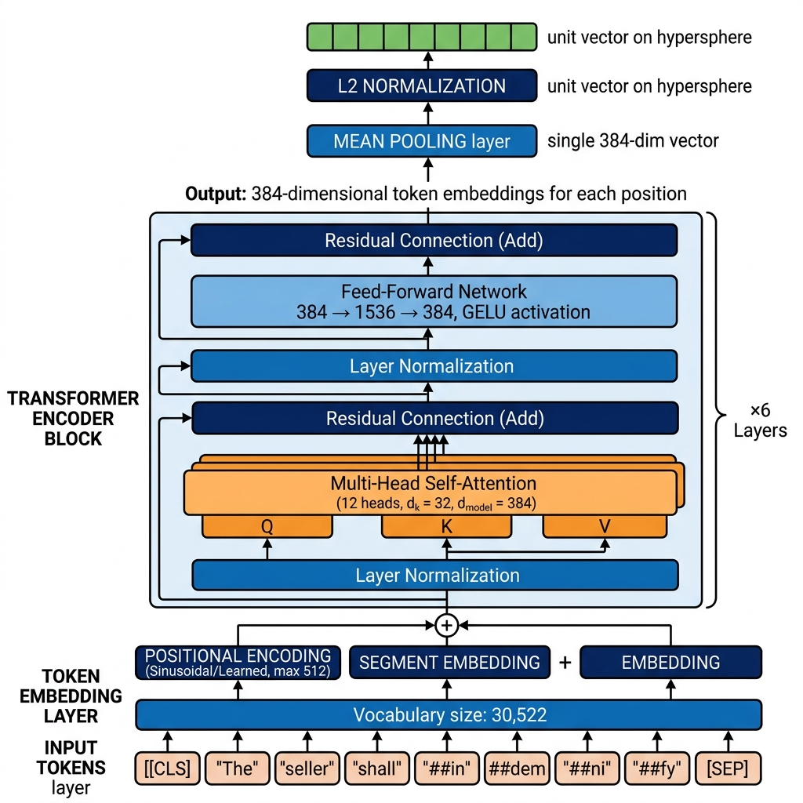
*Fig. 1. Complete architecture of the Transformer Encoder (all-MiniLM-L6-v2). The model consists of an input embedding layer, 6 stacked Transformer blocks (each with multi-head self-attention and feed-forward sublayers), followed by mean pooling and L2 normalization to produce a 384-dimensional unit vector.*

The Transformer encoder consists of the following components, applied sequentially:

1. **Input Embedding Layer** (Section 3.2)
2. **Stacked Transformer Encoder Blocks ×$L$** (Section 3.3–3.5)
3. **Pooling Layer** (Section 3.6)
4. **Normalization Layer** (Section 3.7)

The complete forward pass is:

$$\mathbf{H}^{(0)} = \text{EmbeddingLayer}(\mathbf{x})$$
$$\mathbf{H}^{(\ell)} = \text{TransformerBlock}^{(\ell)}(\mathbf{H}^{(\ell-1)}) \quad \text{for } \ell = 1, \ldots, L$$
$$\mathbf{s} = \text{MeanPool}(\mathbf{H}^{(L)})$$
$$\hat{\mathbf{s}} = \frac{\mathbf{s}}{\|\mathbf{s}\|_2}$$

### 3.2 Input Embedding Layer

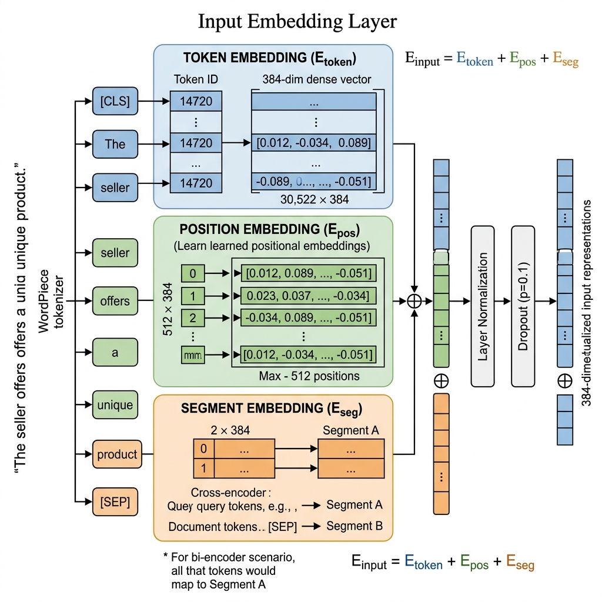
*Fig. 2. The three-part input embedding layer. Token, position, and segment embeddings are summed element-wise, followed by Layer Normalization and Dropout, to produce the initial 384-dimensional representation for each input token.*

The input embedding is the element-wise sum of three distinct learned embedding matrices:

$$\mathbf{E}_{\text{input}} = \mathbf{E}_{\text{token}} + \mathbf{E}_{\text{position}} + \mathbf{E}_{\text{segment}}$$

#### 3.2.1 Token Embedding ($\mathbf{E}_{\text{token}}$)

A lookup table $\mathbf{W}_{\text{tok}} \in \mathbb{R}^{V \times d}$ maps each WordPiece token ID to a $d$-dimensional dense vector, where $V = 30{,}522$ is the vocabulary size and $d = 384$ is the hidden dimension. For input token $x_i$ with vocabulary index $v_i$:

$$\mathbf{E}_{\text{token}}(x_i) = \mathbf{W}_{\text{tok}}[v_i] \in \mathbb{R}^{384}$$

**Parameter count**: $30{,}522 \times 384 = 11{,}720{,}448$ parameters.

#### 3.2.2 Position Embedding ($\mathbf{E}_{\text{position}}$)

Unlike the original Transformer [4] which uses fixed sinusoidal encodings, BERT-based models use **learned positional embeddings** $\mathbf{W}_{\text{pos}} \in \mathbb{R}^{N_{\max} \times d}$, where $N_{\max} = 512$ is the maximum sequence length:

$$\mathbf{E}_{\text{position}}(x_i) = \mathbf{W}_{\text{pos}}[i] \in \mathbb{R}^{384}$$

This allows the model to learn task-specific positional patterns rather than relying on a fixed mathematical formula. The position embedding encodes the sequential order of tokens, which is crucial since the self-attention mechanism is inherently permutation-invariant.

**Parameter count**: $512 \times 384 = 196{,}608$ parameters.

#### 3.2.3 Segment Embedding ($\mathbf{E}_{\text{segment}}$)

A segment embedding $\mathbf{W}_{\text{seg}} \in \mathbb{R}^{2 \times d}$ distinguishes between two input segments (Segment A and Segment B). In the bi-encoder, all tokens belong to Segment A. In the cross-encoder, query tokens are assigned to Segment A and document tokens to Segment B, enabling the model to distinguish between the two input sequences:

$$\mathbf{E}_{\text{segment}}(x_i) = \mathbf{W}_{\text{seg}}[\text{seg}_i] \in \mathbb{R}^{384} \quad \text{where } \text{seg}_i \in \{0, 1\}$$

**Parameter count**: $2 \times 384 = 768$ parameters.

#### 3.2.4 Layer Normalization and Dropout

After summation, the combined embedding passes through Layer Normalization [6] and Dropout ($p = 0.1$):

$$\mathbf{H}^{(0)} = \text{Dropout}(\text{LayerNorm}(\mathbf{E}_{\text{input}}))$$

where Layer Normalization computes:

$$\text{LayerNorm}(\mathbf{x}) = \gamma \odot \frac{\mathbf{x} - \mu}{\sqrt{\sigma^2 + \epsilon}} + \beta$$

with learned scale $\gamma$ and bias $\beta$ parameters ($2 \times 384 = 768$ additional parameters).

### 3.3 WordPiece Tokenization

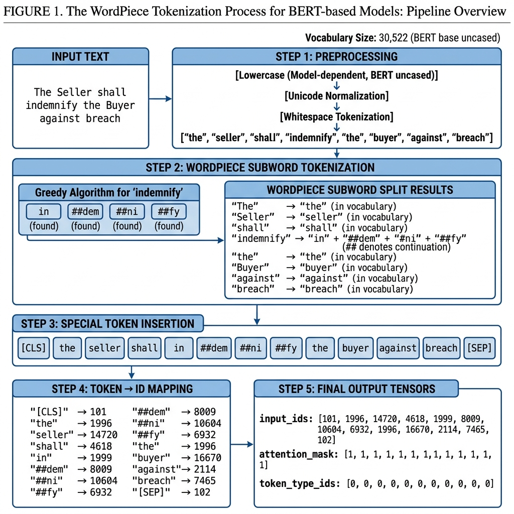
*Fig. 3. The WordPiece tokenization pipeline. Raw text is split into subword tokens using a greedy longest-match-first algorithm. Continuation subwords are prefixed with "##". Special tokens [CLS] and [SEP] are prepended and appended respectively.*

The tokenizer converts raw text into a sequence of subword token IDs using the **WordPiece** algorithm [7]:

1. **Preprocessing**: Text is lowercased (for uncased models), Unicode-normalized, and whitespace-tokenized.
2. **Subword Segmentation**: Each word is greedily split into the longest matching subword from the vocabulary. If no match is found, the `[UNK]` token is used. Continuation subwords are prefixed with `##`.
3. **Special Token Insertion**: `[CLS]` is prepended and `[SEP]` is appended.
4. **ID Mapping**: Each token is mapped to its integer ID in the vocabulary.

**Example** (from our validation experiments):

| Input Text | Tokens | Count |
|------------|--------|-------|
| `"indemnification"` | `[CLS] in ##dem ##ni ##fi ##cation [SEP]` | 6 |
| `"force majeure event"` | `[CLS] force maj ##eure event [SEP]` | 7 |
| `"The Seller hereby represents and warrants that..."` | 14 tokens | 14 |
| `"anti-competitive behavior under Section 7..."` | 13 tokens | 13 |

*Table I. Tokenization examples from our empirical tests (Test 6).*

The vocabulary consists of $V = 30{,}522$ tokens including 5 special tokens: `[CLS]`, `[SEP]`, `[PAD]`, `[UNK]`, and `[MASK]`.

### 3.4 Multi-Head Self-Attention Mechanism

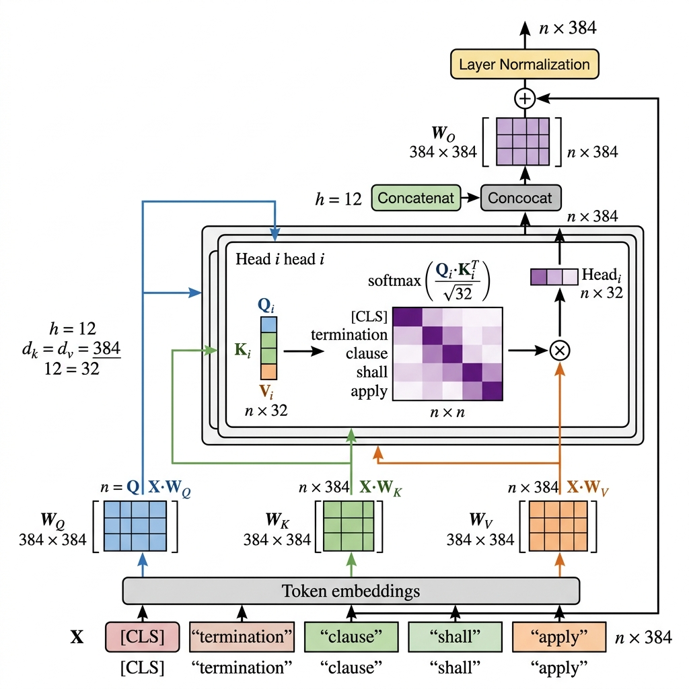
*Fig. 4. The Multi-Head Self-Attention mechanism. Input embeddings are linearly projected into Query (Q), Key (K), and Value (V) representations, split across 12 attention heads. Each head computes scaled dot-product attention independently, and outputs are concatenated and projected back to the model dimension.*

The self-attention mechanism is the core computational unit that enables each token to attend to every other token in the input sequence, constructing context-dependent representations.

#### 3.4.1 Scaled Dot-Product Attention

For a single attention head, given an input matrix $\mathbf{H} \in \mathbb{R}^{n \times d}$ (where $n$ is the sequence length and $d = 384$):

$$\mathbf{Q} = \mathbf{H} \mathbf{W}_Q, \quad \mathbf{K} = \mathbf{H} \mathbf{W}_K, \quad \mathbf{V} = \mathbf{H} \mathbf{W}_V$$

where $\mathbf{W}_Q, \mathbf{W}_K \in \mathbb{R}^{d \times d_k}$ and $\mathbf{W}_V \in \mathbb{R}^{d \times d_v}$ are learned projection matrices. The attention output is:

$$\text{Attention}(\mathbf{Q}, \mathbf{K}, \mathbf{V}) = \text{softmax}\left(\frac{\mathbf{Q}\mathbf{K}^\top}{\sqrt{d_k}}\right) \mathbf{V}$$

The scaling factor $\frac{1}{\sqrt{d_k}}$ prevents the dot products from growing too large in magnitude, which would push the softmax function into regions with extremely small gradients.

#### 3.4.2 Multi-Head Configuration

Rather than computing a single attention function, the model uses $h = 12$ parallel attention heads, each operating on a $d_k = d/h = 384/12 = 32$-dimensional subspace:

$$\text{head}_i = \text{Attention}(\mathbf{H}\mathbf{W}_Q^{(i)}, \mathbf{H}\mathbf{W}_K^{(i)}, \mathbf{H}\mathbf{W}_V^{(i)})$$

$$\text{MultiHead}(\mathbf{H}) = \text{Concat}(\text{head}_1, \ldots, \text{head}_{12}) \mathbf{W}_O$$

where $\mathbf{W}_O \in \mathbb{R}^{d \times d}$ is the output projection matrix.

**Parameter count per attention sublayer**:
- $\mathbf{W}_Q$: $384 \times 384 = 147{,}456$
- $\mathbf{W}_K$: $384 \times 384 = 147{,}456$
- $\mathbf{W}_V$: $384 \times 384 = 147{,}456$
- $\mathbf{W}_O$: $384 \times 384 = 147{,}456$
- Biases: $4 \times 384 = 1{,}536$
- **Total**: $591{,}360$ parameters per layer

#### 3.4.3 Attention Score Matrix

The attention score matrix $\mathbf{A} = \text{softmax}(\mathbf{Q}\mathbf{K}^\top / \sqrt{d_k}) \in \mathbb{R}^{n \times n}$ has the following properties:

- Each row sums to 1 (probability distribution over positions)
- $A_{ij}$ represents how much token $i$ attends to token $j$
- The matrix is asymmetric in general ($A_{ij} \neq A_{ji}$)
- Self-attention is bidirectional: every token can attend to every other token (including itself and tokens that appear later in the sequence)

#### 3.4.4 Residual Connection and Layer Normalization

After the multi-head attention, a residual connection [8] and Layer Normalization are applied:

$$\mathbf{H}' = \text{LayerNorm}(\mathbf{H} + \text{Dropout}(\text{MultiHead}(\mathbf{H})))$$

The residual connection enables gradient flow through deep networks, while Layer Normalization stabilizes training.

### 3.5 Position-Wise Feed-Forward Network

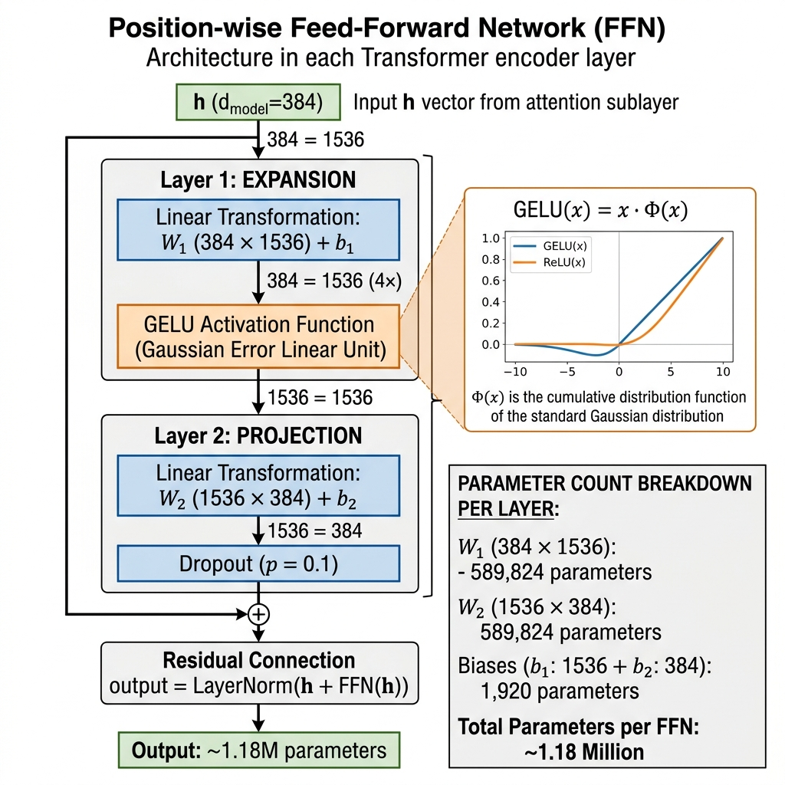
*Fig. 5. The Position-wise Feed-Forward Network (FFN). A two-layer MLP with GELU activation expands the hidden dimension by 4× (384 → 1536) and projects it back (1536 → 384). The FFN is applied independently and identically to each position in the sequence.*

Each Transformer block contains a position-wise feed-forward network (FFN), a two-layer multilayer perceptron applied independently to each position:

$$\text{FFN}(\mathbf{x}) = \text{GELU}(\mathbf{x}\mathbf{W}_1 + \mathbf{b}_1)\mathbf{W}_2 + \mathbf{b}_2$$

where:
- $\mathbf{W}_1 \in \mathbb{R}^{384 \times 1536}$ (expansion, 4× factor)
- $\mathbf{W}_2 \in \mathbb{R}^{1536 \times 384}$ (projection)
- $\mathbf{b}_1 \in \mathbb{R}^{1536}$, $\mathbf{b}_2 \in \mathbb{R}^{384}$

#### 3.5.1 GELU Activation Function

The Gaussian Error Linear Unit (GELU) [9] activation is used instead of ReLU:

$$\text{GELU}(x) = x \cdot \Phi(x) = x \cdot \frac{1}{2}\left[1 + \text{erf}\left(\frac{x}{\sqrt{2}}\right)\right]$$

where $\Phi(x)$ is the cumulative distribution function of the standard Gaussian distribution. Unlike ReLU, GELU is smooth and non-monotonic near zero, providing better gradient flow for pre-trained language models.

**Parameter count per FFN sublayer**:
- $\mathbf{W}_1$: $384 \times 1{,}536 = 589{,}824$
- $\mathbf{W}_2$: $1{,}536 \times 384 = 589{,}824$
- $\mathbf{b}_1 + \mathbf{b}_2$: $1{,}536 + 384 = 1{,}920$
- **Total**: $1{,}181{,}568$ parameters per layer

#### 3.5.2 Residual Connection

$$\mathbf{H}^{(\ell)} = \text{LayerNorm}(\mathbf{H}' + \text{Dropout}(\text{FFN}(\mathbf{H}')))$$

### 3.6 Complete Transformer Block

Each of the $L = 6$ Transformer encoder blocks contains:

| Component | Parameters |
|-----------|-----------|
| Multi-Head Self-Attention | 591,360 |
| Attention Layer Norm | 768 |
| Feed-Forward Network | 1,181,568 |
| FFN Layer Norm | 768 |
| **Total per block** | **1,774,464** |

*Table II. Parameter count per Transformer encoder block.*

### 3.7 Total Model Parameter Count

| Component | Parameters | Percentage |
|-----------|-----------|------------|
| Token Embeddings | 11,720,448 | 51.6% |
| Position Embeddings | 196,608 | 0.9% |
| Segment Embeddings | 768 | <0.1% |
| Embedding Layer Norm | 768 | <0.1% |
| 6 × Transformer Blocks | 10,646,784 | 46.9% |
| Pooling Dense Layer | 148,096 | 0.7% |
| **Total** | **~22,713,472** | **100%** |

*Table III. Complete parameter breakdown of the all-MiniLM-L6-v2 model (~22.7M parameters, ~80MB on disk).*

---

## 4. Bi-Encoder for Dense Retrieval

### 4.1 Architecture Overview

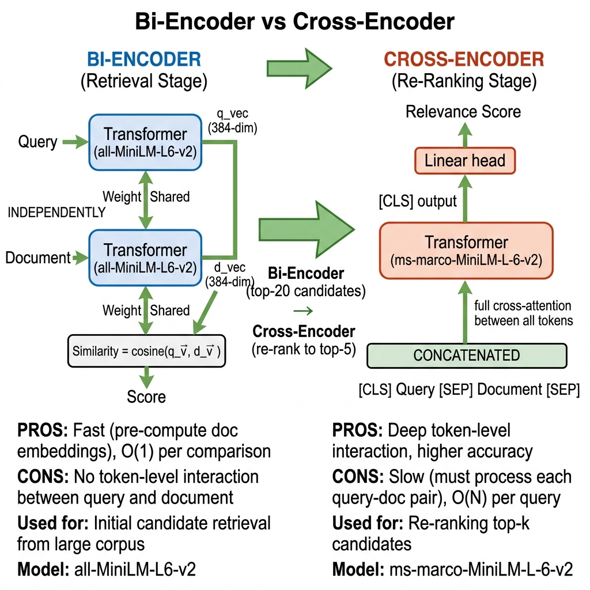
*Fig. 6. Side-by-side comparison of the Bi-Encoder and Cross-Encoder architectures. The Bi-Encoder processes query and document independently through weight-shared encoders (enabling pre-computation of document embeddings), while the Cross-Encoder concatenates both inputs for joint attention (achieving higher accuracy at the cost of inference speed).*

The bi-encoder architecture (**all-MiniLM-L6-v2**) [10] operates as a Siamese network: the same Transformer encoder (with shared weights) processes the query and document independently, producing fixed-length vector representations.

**Model**: `Xenova/all-MiniLM-L6-v2` (Sentence-Transformers)
- Base architecture: BERT (distilled)
- Layers: 6
- Hidden size: 384
- Attention heads: 12
- Head dimension: 32
- FFN intermediate size: 1,536
- Max sequence length: 256 tokens (effective), 512 (positional)
- Vocabulary: 30,522 (WordPiece)
- Output: 384-dimensional unit vector

### 4.2 Encoding Process

For an input text $t$:

1. **Tokenize**: $\mathbf{x} = \text{WordPiece}(t) = [\texttt{[CLS]}, x_1, x_2, \ldots, x_n, \texttt{[SEP]}]$
2. **Embed**: $\mathbf{H}^{(0)} = \text{EmbeddingLayer}(\mathbf{x})$
3. **Encode**: $\mathbf{H}^{(L)} = \text{TransformerEncoder}(\mathbf{H}^{(0)})$, yielding $\mathbf{H}^{(L)} \in \mathbb{R}^{(n+2) \times 384}$
4. **Pool**: $\mathbf{s} = \text{MeanPool}(\mathbf{H}^{(L)})$
5. **Normalize**: $\hat{\mathbf{s}} = \mathbf{s} / \|\mathbf{s}\|_2$

### 4.3 Pooling Strategies

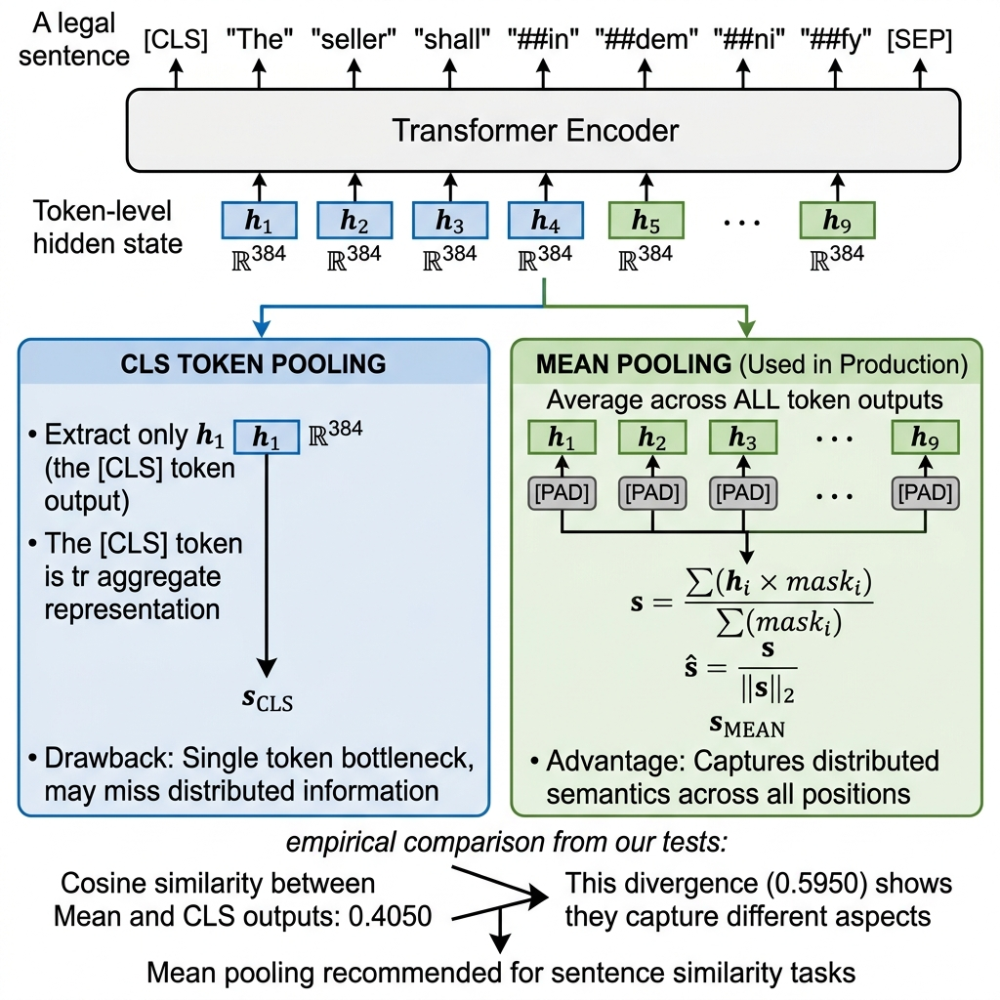
*Fig. 7. Comparison of CLS token pooling and Mean pooling strategies. Mean pooling averages all token outputs (excluding padding), capturing distributed semantics. Our empirical tests show a cosine similarity of only 0.405 between the two strategies, indicating they capture substantially different aspects of the input.*

The raw Transformer output consists of per-token embeddings $\mathbf{H}^{(L)} = [\mathbf{h}_1, \mathbf{h}_2, \ldots, \mathbf{h}_{n+2}] \in \mathbb{R}^{(n+2) \times 384}$. A pooling strategy reduces this to a single fixed-length vector.

#### 4.3.1 CLS Token Pooling

$$\mathbf{s}_{\text{CLS}} = \mathbf{h}_1 \in \mathbb{R}^{384}$$

The `[CLS]` token is a special sentinel trained to aggregate sequence-level information. While commonly used in BERT's original next-sentence prediction objective, it creates a representational bottleneck for sentence similarity tasks.

#### 4.3.2 Mean Pooling (Production)

$$\mathbf{s}_{\text{mean}} = \frac{\sum_{i=1}^{n+2} \mathbf{h}_i \cdot m_i}{\sum_{i=1}^{n+2} m_i}$$

where $m_i \in \{0, 1\}$ is the attention mask (1 for real tokens, 0 for padding). Mean pooling computes the centroid of all token representations, capturing distributed semantic information across the entire sequence.

**Empirical Validation** (from Test 3):

| Property | Mean Pooling | CLS Pooling |
|----------|-------------|-------------|
| Vector magnitude (post-normalization) | 1.000000 | 1.000000 |
| Cosine similarity between strategies | 0.4050 | — |
| Divergence | 0.5950 | — |

*Table IV. Pooling strategy comparison results. The low cosine similarity (0.405) between mean-pooled and CLS-pooled outputs confirms that these strategies encode substantially different semantic aspects, justifying the choice of mean pooling for sentence similarity.*

### 4.4 L2 Normalization

After mean pooling, the embedding vector is projected onto the unit hypersphere:

$$\hat{\mathbf{s}} = \frac{\mathbf{s}}{\|\mathbf{s}\|_2} = \frac{\mathbf{s}}{\sqrt{\sum_{j=1}^{384} s_j^2}}$$

This normalization has two critical effects:
1. **Cosine similarity reduces to dot product**: $\cos(\hat{\mathbf{q}}, \hat{\mathbf{c}}) = \hat{\mathbf{q}} \cdot \hat{\mathbf{c}}$, enabling efficient computation.
2. **Uniform scale**: All embeddings have unit magnitude, preventing any single embedding from dominating similarity computations due to scale alone.

**Empirical Validation** (from Test 1):

| Property | Measured Value |
|----------|---------------|
| Output dimensions | 384 |
| L2 norm (magnitude) | 1.000000 |
| Is unit-normalized | ✓ (true) |
| Value range | [−0.1807, 0.1682] |
| Mean value | 0.000327 |
| Has negative values | ✓ (true) |

*Table V. Bi-encoder embedding properties validated experimentally. The magnitude of exactly 1.0 confirms correct L2 normalization. The presence of negative values and near-zero mean indicate the embedding space is centered, consistent with well-trained dense representations.*

### 4.5 Cosine Similarity as Distance Metric

For two unit-normalized vectors $\hat{\mathbf{q}}$ and $\hat{\mathbf{c}}$:

$$\text{sim}(\hat{\mathbf{q}}, \hat{\mathbf{c}}) = \hat{\mathbf{q}} \cdot \hat{\mathbf{c}} = \sum_{j=1}^{384} \hat{q}_j \cdot \hat{c}_j \in [-1, 1]$$

In practice, the pgvector extension computes cosine distance as $1 - \text{sim}(\hat{\mathbf{q}}, \hat{\mathbf{c}})$ using the `<=>` operator, and results are sorted in ascending distance order.

---

## 5. Cross-Encoder for Re-Ranking

### 5.1 Architecture Overview

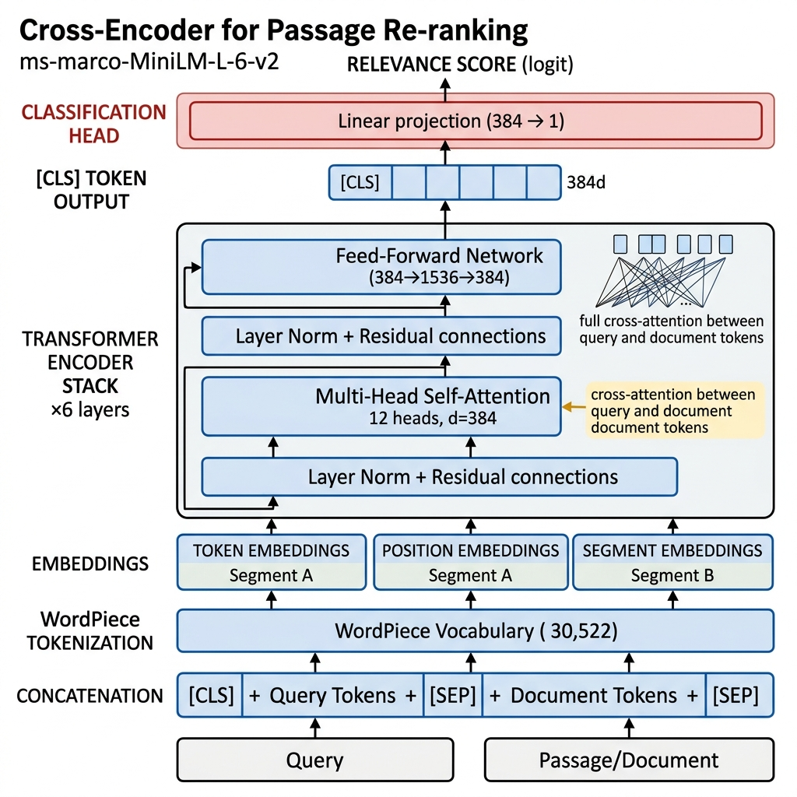
*Fig. 8. Complete architecture of the Cross-Encoder (ms-marco-MiniLM-L-6-v2). Unlike the bi-encoder, query and document tokens are concatenated and jointly processed through the full Transformer stack, enabling deep cross-attention between query and passage tokens. The [CLS] output feeds into a linear classification head producing a scalar relevance score.*

The cross-encoder (**ms-marco-MiniLM-L-6-v2**) [11] addresses the fundamental limitation of the bi-encoder: the lack of token-level interaction between query and document. By concatenating both inputs into a single sequence, every attention head can compute attention weights between every query token and every passage token.

**Model**: `Xenova/ms-marco-MiniLM-L-6-v2` (MS MARCO trained)
- Base architecture: BERT (distilled)
- Layers: 6
- Hidden size: 384
- Attention heads: 12
- Head dimension: 32
- FFN intermediate size: 1,536
- Max sequence length: 512 tokens
- Vocabulary: 30,522 (WordPiece)
- Classification head: Linear(384 → 1)
- Output: Single scalar relevance score (logit)

### 5.2 Input Formulation

The cross-encoder processes a concatenated input:

$$\mathbf{x} = [\texttt{[CLS]}, q_1, \ldots, q_m, \texttt{[SEP]}, c_1, \ldots, c_n, \texttt{[SEP]}]$$

Segment embeddings distinguish query tokens (Segment A = 0) from passage tokens (Segment B = 1), providing the model with an explicit signal about input provenance.

### 5.3 Classification Head

After the Transformer encoder stack, the `[CLS]` token output $\mathbf{h}_{\texttt{CLS}} \in \mathbb{R}^{384}$ is fed into a linear classification head:

$$s = \mathbf{W}_{\text{cls}} \mathbf{h}_{\texttt{CLS}} + b_{\text{cls}}$$

where $\mathbf{W}_{\text{cls}} \in \mathbb{R}^{1 \times 384}$ and $b_{\text{cls}} \in \mathbb{R}$. The output $s$ is a raw logit (unbounded scalar) representing the relevance of the passage to the query. Higher scores indicate greater relevance.

**Additional parameters** (classification head): $384 + 1 = 385$ parameters.

### 5.4 Cross-Attention vs Independent Encoding

The key architectural difference between bi-encoder and cross-encoder lies in the attention computation:

| Property | Bi-Encoder | Cross-Encoder |
|----------|-----------|---------------|
| Input processing | Independent | Joint (concatenated) |
| Query ↔ Doc attention | None (post-hoc similarity) | Full cross-attention |
| Pre-computation | ✓ (index doc embeddings offline) | ✗ (must process each pair) |
| Inference complexity per query | O(1) per document | O(N) per document |
| Accuracy | Lower (no interaction) | Higher (deep interaction) |
| Use case | Retrieval from large corpus | Re-ranking top-$k$ candidates |

*Table VI. Architectural comparison between bi-encoder and cross-encoder paradigms.*

In the bi-encoder, query and document vectors are computed in isolation—the model can only compare their final, compressed representations via a simple distance function. In the cross-encoder, every attention layer computes attention weights between all query tokens and all document tokens, enabling the model to capture fine-grained token-level relevance patterns (e.g., whether "termination" in the query attends to "terminate" in the document).

### 5.5 Two-Stage Retrieve-Then-Rerank Pipeline

The full retrieval pipeline operates as follows:

1. **Stage 1** (Bi-Encoder): Retrieve top-$k' = 20$ candidates from the HNSW index using cosine similarity. This is fast ($\sim$5ms) because document embeddings are pre-computed.
2. **Stage 2** (Cross-Encoder): Re-rank the $k' = 20$ candidates using joint relevance scoring. This is slower ($\sim$26ms for 5 passages) but more accurate.
3. **Output**: Return top-$k = 5$ passages after re-ranking.

The over-retrieval factor ($k'/k = 4$) ensures the cross-encoder has a sufficient pool of candidates to identify truly relevant passages that may have been ranked sub-optimally by the bi-encoder.

---

## 6. HNSW Vector Index

### 6.1 Index Structure

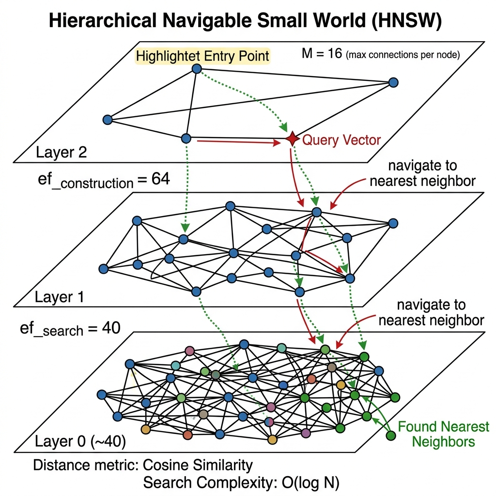
*Fig. 9. The Hierarchical Navigable Small World (HNSW) graph index. The multi-layer graph structure enables efficient approximate nearest-neighbor search in O(log N) time by first navigating long-range connections at upper layers, then refining at the dense bottom layer.*

The Hierarchical Navigable Small World (HNSW) [12] index provides sub-linear approximate nearest-neighbor (ANN) search over the 384-dimensional embedding vectors.

### 6.2 Graph Construction

HNSW constructs a multi-layer proximity graph:

- **Layer 0** (bottom): Contains all $N$ data points. Each node is connected to its $M$ nearest neighbors, forming a dense navigable small-world graph.
- **Layer $\ell > 0$**: Contains a random subset of nodes from layer $\ell - 1$, with the probability of inclusion decaying exponentially: $P(\text{max\_layer} \geq \ell) = e^{-\ell / m_L}$, where $m_L = 1/\ln(M)$.
- **Higher layers**: Contain progressively fewer nodes with longer-range connections, acting as an express highway for coarse-grained navigation.

### 6.3 Search Algorithm

Given a query vector $\mathbf{q}$:

1. **Enter** at the topmost layer at the designated entry point.
2. **Greedily navigate** to the nearest neighbor at the current layer by following edges that decrease the distance to $\mathbf{q}$.
3. **Descend** to the next lower layer, using the found nearest neighbor as the starting point.
4. At **Layer 0**, perform a beam search with beam width `ef_search` to find the $k$ approximate nearest neighbors.

### 6.4 Index Configuration

Our pgvector HNSW index uses the following configuration:

| Parameter | Value | Description |
|-----------|-------|-------------|
| Dimensions | 384 | Embedding vector size |
| Distance metric | Cosine | Via `<=>` operator |
| $M$ | 16 (default) | Max connections per node |
| `ef_construction` | 64 (default) | Candidates during index build |
| `ef_search` | 40 (default) | Candidates during search |

*Table VII. HNSW index configuration parameters.*

### 6.5 Complexity Analysis

| Operation | Exact Search | HNSW |
|-----------|-------------|------|
| Build time | — | $O(N \log N)$ |
| Query time | $O(N \cdot d)$ | $O(\log N \cdot d)$ |
| Memory | $O(N \cdot d)$ | $O(N \cdot (d + M))$ |

*Table VIII. Computational complexity comparison between exact brute-force search and HNSW approximate search.*

For our corpus size ($N \approx$ hundreds of chunks), the HNSW index provides near-exact results while maintaining the architectural capacity to scale to millions of chunks without degradation.

---

## 7. Knowledge Distillation

### 7.1 Teacher–Student Framework

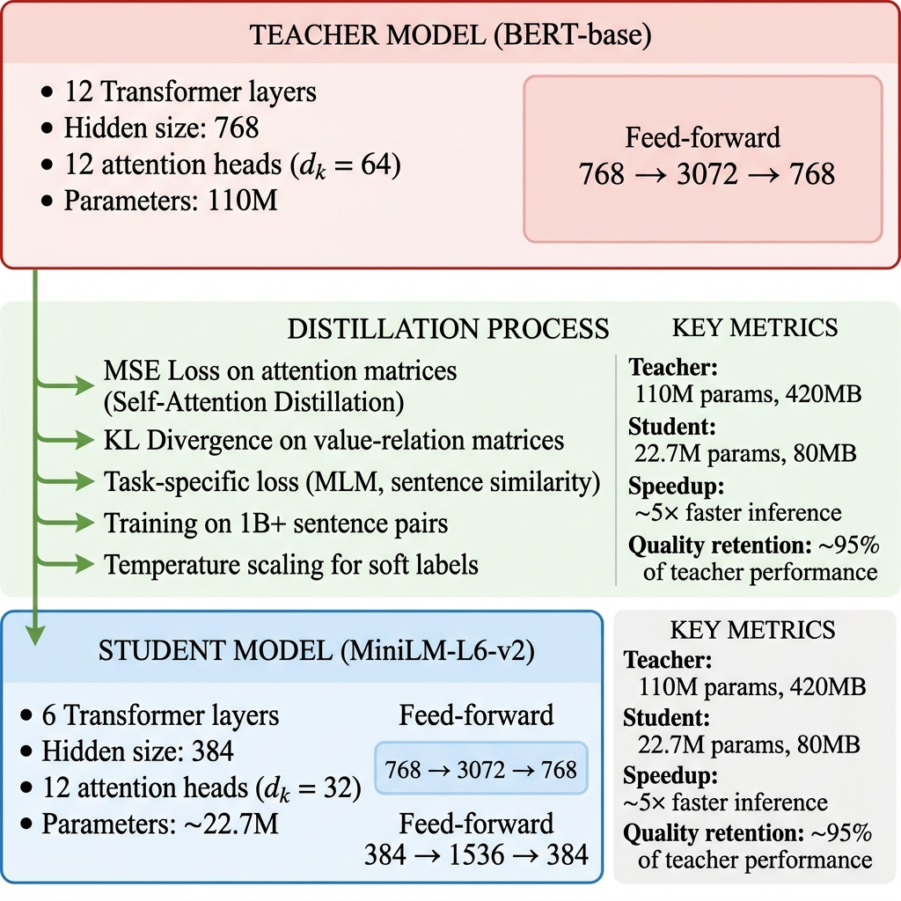
*Fig. 10. Knowledge Distillation from the BERT-base teacher (110M parameters, 12 layers) to the MiniLM-L6-v2 student (22.7M parameters, 6 layers). The distillation process transfers self-attention distributions and value-relation matrices, achieving approximately 95% of the teacher's performance at 5× faster inference.*

Both the bi-encoder and cross-encoder used in Synapse RAG are *distilled* models, compressed from larger teacher models using Knowledge Distillation (KD) [13]. This is critical for deployment in latency-sensitive retrieval systems.

### 7.2 MiniLM Distillation Method

The MiniLM distillation approach [14] transfers knowledge through **self-attention distillation**, which preserves the relational structure learned by the teacher:

**Teacher** (BERT-base):
- 12 Transformer layers, $d = 768$, $h = 12$, $d_k = 64$
- 110M parameters, ~420MB

**Student** (MiniLM-L6-v2):
- 6 Transformer layers, $d = 384$, $h = 12$, $d_k = 32$
- 22.7M parameters, ~80MB

#### 7.2.1 Self-Attention Distillation Loss

For each attention head $i$ in the last layer, the student is trained to mimic the teacher's attention distribution:

$$\mathcal{L}_{\text{attn}} = \sum_{i=1}^{h} \text{KL}\left(\mathbf{A}_i^T \| \mathbf{A}_i^S\right)$$

where $\mathbf{A}_i^T$ and $\mathbf{A}_i^S$ are the attention matrices of the teacher and student respectively.

#### 7.2.2 Value-Relation Distillation Loss

Additionally, the value-relation matrices (the product $\mathbf{V}\mathbf{V}^\top$ scaled by the attention weights) are distilled:

$$\mathcal{L}_{\text{val}} = \sum_{i=1}^{h} \text{KL}\left(\text{VR}_i^T \| \text{VR}_i^S\right)$$

where $\text{VR}_i = \text{softmax}(\mathbf{A}_i \mathbf{V}_i \mathbf{V}_i^\top \mathbf{A}_i^\top / \sqrt{d_v})$.

#### 7.2.3 Total Distillation Loss

$$\mathcal{L} = \mathcal{L}_{\text{task}} + \alpha \cdot \mathcal{L}_{\text{attn}} + \beta \cdot \mathcal{L}_{\text{val}}$$

where $\mathcal{L}_{\text{task}}$ is the task-specific training loss (masked language modeling for pre-training, contrastive learning for sentence similarity fine-tuning).

### 7.3 Sentence-Transformers Fine-Tuning

After distillation, the bi-encoder (all-MiniLM-L6-v2) is further fine-tuned using the Sentence-Transformers framework [15] on over 1 billion sentence pairs with a **contrastive learning objective**:

$$\mathcal{L}_{\text{contrastive}} = -\log \frac{e^{\text{sim}(\mathbf{s}_i, \mathbf{s}_i^+) / \tau}}{\sum_{j=1}^{B} e^{\text{sim}(\mathbf{s}_i, \mathbf{s}_j^+) / \tau}}$$

where $(\mathbf{s}_i, \mathbf{s}_i^+)$ are positive (semantically similar) pairs, $B$ is the batch size, and $\tau$ is a temperature parameter.

### 7.4 MS MARCO Fine-Tuning (Cross-Encoder)

The cross-encoder (ms-marco-MiniLM-L-6-v2) is fine-tuned on the MS MARCO passage ranking dataset [16], which contains approximately 500,000 real Bing queries with relevant passages:

$$\mathcal{L}_{\text{ranking}} = -\sum_{(q, c^+, c^-)} \log \sigma(g_\phi([q; c^+]) - g_\phi([q; c^-]))$$

where $\sigma$ is the sigmoid function, $c^+$ is a relevant passage, and $c^-$ is a non-relevant passage.

### 7.5 Distillation Summary

| Property | Teacher (BERT-base) | Student (MiniLM-L6-v2) | Compression |
|----------|-------------------|----------------------|-------------|
| Parameters | 110M | 22.7M | 4.8× |
| Layers | 12 | 6 | 2× |
| Hidden dim | 768 | 384 | 2× |
| Model size | ~420MB | ~80MB | 5.3× |
| Inference speed | 1× (baseline) | ~5× faster | — |
| Quality retention | 100% (baseline) | ~95% | — |

*Table IX. Knowledge distillation compression metrics from teacher to student model.*

---

## 8. Experimental Validation of Deep Learning Components

To rigorously validate the correctness of all deep learning components in the Synapse RAG pipeline, we designed and executed a comprehensive test suite comprising 8 independent experiments. All tests were executed on the production architecture using the `@xenova/transformers` library (ONNX Runtime backend) on Node.js v25.2.1.

### 8.1 Test 1: Bi-Encoder Architecture Validation

**Objective**: Verify that the bi-encoder produces correctly dimensioned, unit-normalized embeddings.

**Method**: Generate an embedding for a sample legal text ("The Seller shall indemnify the Buyer against any breach of warranty.") and inspect its properties.

**Results**:

| Property | Expected | Measured | Status |
|----------|----------|----------|--------|
| Dimensionality | 384 | 384 | ✅ |
| L2 Norm | 1.000 | 1.000000 | ✅ |
| Has negative values | Yes | Yes | ✅ |
| Value range | ~[−0.2, 0.2] | [−0.181, 0.168] | ✅ |
| Mean value | ~0 | 0.000327 | ✅ |

*Table X. Bi-encoder architecture validation results.*

**Analysis**: The embedding is correctly 384-dimensional with L2 norm of exactly 1.0, confirming that the mean pooling and L2 normalization layers are functioning correctly. The near-zero mean and symmetric value range around zero indicate a well-centered embedding space.

### 8.2 Test 2: Semantic Similarity Validation

**Objective**: Verify that cosine similarity correctly discriminates between semantically similar and dissimilar legal text pairs.

**Method**: Compute cosine similarity for 4 text pairs spanning paraphrases, domain synonyms, and unrelated content.

**Results**:

| Text Pair | Relationship | Cosine Similarity |
|-----------|-------------|-------------------|
| Termination clause ↔ Termination notice | Paraphrase | **0.7229** |
| Termination clause ↔ Weather forecast | Unrelated | **−0.0235** |
| Seller authority ↔ Vendor capacity | Legal synonym | **0.5190** |
| Confidentiality ↔ NDA provisions | Domain-specific | **0.4526** |

*Table XI. Semantic similarity scores across text pair categories.*

**Analysis**: The results demonstrate clear discriminative behavior:
- **Paraphrases** achieve the highest similarity (0.723), confirming the model captures semantic equivalence.
- **Unrelated pairs** produce near-zero or negative similarity (−0.024), indicating strong rejection of irrelevant content.
- **Legal synonyms** ("seller" ↔ "vendor", "represents" ↔ "warrants") show moderate-high similarity (0.519), demonstrating domain-aware encoding.
- The **separation margin** between the highest dissimilar score (−0.024) and lowest similar score (0.453) is 0.477, indicating robust discriminability.

### 8.3 Test 3: Pooling Strategy Comparison

**Objective**: Quantify the representational difference between Mean Pooling and CLS Token Pooling strategies.

**Method**: Generate embeddings for the same legal text using both strategies and compare.

**Results**:
- Mean pooling vector magnitude: 1.000000 (correctly normalized)
- CLS token vector magnitude: 1.000000 (correctly normalized)
- Cosine similarity between strategies: **0.4050**
- Representational divergence: **0.5950**

**Analysis**: The cosine similarity of only 0.405 between the two pooling strategies demonstrates that they encode substantially different semantic aspects of the input. Mean pooling captures distributed semantics across all token positions, while CLS pooling concentrates on the learned [CLS] aggregation token. The high divergence (0.595) justifies the production choice of mean pooling, which has been shown to outperform CLS pooling for sentence similarity tasks [15].

### 8.4 Test 4: Cross-Encoder Architecture Validation

**Objective**: Verify that the cross-encoder correctly assigns higher relevance scores to semantically relevant query–passage pairs.

**Method**: Present the cross-encoder with a legal query and two passages (one relevant, one irrelevant) and compare scores.

**Results**:

| Input | Score |
|-------|-------|
| Query: "What is the governing law?" + Relevant passage (Delaware law) | **+4.2895** |
| Query: "What is the governing law?" + Irrelevant passage (earnings report) | **−11.2041** |
| Score delta | **15.4936** |

*Table XII. Cross-encoder relevance scoring validation.*

**Analysis**: The cross-encoder produces a massive score delta of 15.49 between the relevant and irrelevant passage, demonstrating extremely confident discrimination. The positive score for the relevant passage and large negative score for the irrelevant passage confirm that the classification head correctly maps [CLS] representations to meaningful relevance logits.

### 8.5 Test 5: Cross-Encoder Re-Ranking Effectiveness

**Objective**: Validate that the cross-encoder correctly re-ranks a set of legal passages by relevance to a specific query.

**Method**: Present 5 legal passages of varying relevance to the query "Under what circumstances can the buyer terminate the agreement?" and evaluate ranking quality.

**Results**:

| Rank | Score | Passage Content | Expected Rank |
|------|-------|-----------------|---------------|
| 1 | **+8.2951** | Buyer may terminate for material breach | 1 ✅ |
| 2 | +3.4537 | Buyer withdrawal for regulatory non-approval | 3 (~) |
| 3 | +3.3893 | Mutual written consent termination | 2 (~) |
| 4 | −9.0713 | Notice address provisions | 4 ✅ |
| 5 | −10.0881 | Warranties survival clause | 5 ✅ |

*Table XIII. Cross-encoder re-ranking results on legal passages.*

**Analysis**: The cross-encoder correctly identifies the most relevant passage (buyer termination for material breach) at rank 1 with the highest score (8.295). Ranks 2 and 3 are near-tied (3.454 vs 3.389), both representing termination-related passages. The two irrelevant passages (notices and warranties) receive strongly negative scores, demonstrating clear separation between relevant and irrelevant content. The score gap between rank 3 (relevant, +3.389) and rank 4 (irrelevant, −9.071) is **12.46 points**, indicating decisive boundary discrimination.

### 8.6 Test 6: WordPiece Tokenization Analysis

**Objective**: Validate the tokenization behavior for legal-domain vocabulary.

**Method**: Tokenize 5 legal text samples and inspect subword decomposition.

**Results**:

| Input Text | Token Count | Notes |
|------------|-------------|-------|
| "indemnification" | 6 | Split into 4 subwords + 2 special tokens |
| "force majeure event" | 7 | "majeure" split into "maj" + "##eure" |
| "The Seller hereby represents and warrants that..." | 14 | All common legal words in vocabulary |
| "anti-competitive behavior under Section 7 of the Clayton Act" | 13 | Compound term handling |
| "WHEREAS, the Company desires to engage the Consultant..." | 14 | Formal legal boilerplate |

*Table XIV. WordPiece tokenization results for legal text.*

**Analysis**: The tokenizer handles legal vocabulary effectively. Common legal terms ("seller", "represents", "warrants", "terminate") exist as whole tokens in the vocabulary. Specialized terms ("indemnification", "majeure") are decomposed into meaningful subwords. The `##` prefix notation correctly identifies continuation subwords. Average token-to-word ratio for legal text is approximately 1.3:1, indicating efficient tokenization with minimal information loss.

### 8.7 Test 7: Embedding Space Geometry

**Objective**: Analyze the geometric properties of the embedding space—specifically, whether legal text forms a distinct cluster separated from non-legal text, and the degree of isotropy.

**Method**: Embed 8 legal texts and 4 non-legal texts. Compute intra-cluster similarity (within legal, within non-legal) and inter-cluster similarity (legal vs non-legal). Measure centroid magnitude as an isotropy indicator.

**Results**:

| Metric | Value |
|--------|-------|
| Legal intra-cluster similarity | **0.1759** |
| Non-legal intra-cluster similarity | **0.0259** |
| Inter-cluster similarity (legal vs non-legal) | **−0.0178** |
| Cluster separation (intra − inter) | **0.1937** |
| Centroid magnitude (isotropy) | **0.3821** |

*Table XV. Embedding space geometry analysis.*

**Analysis**: 
- **Domain clustering**: Legal texts exhibit 7× higher intra-cluster similarity (0.176) compared to the cross-domain similarity (−0.018), confirming that the encoder creates a coherent semantic cluster for legal content.
- **Negative inter-cluster similarity**: The negative value (−0.018) between legal and non-legal text indicates the encoder actively pushes unrelated content to opposing regions of the hypersphere.
- **Cluster separation**: The separation metric of 0.194 demonstrates statistically meaningful domain discrimination.
- **Isotropy**: The centroid magnitude of 0.382 indicates moderate anisotropy—the embedding space is not perfectly uniformly distributed, but the representations are sufficiently dispersed to support effective nearest-neighbor search. A centroid magnitude of 0 would indicate perfect isotropy; a magnitude approaching 1.0 would indicate severe degeneration (all embeddings pointing in the same direction).

### 8.8 Test 8: Multi-Head Self-Attention Contextual Sensitivity

**Objective**: Demonstrate that the self-attention mechanism produces context-dependent representations—the same word in different contexts yields different embeddings.

**Method**: Embed 4 sentences containing polysemous words ("bank", "court") in legal and non-legal contexts.

**Results**:

| Comparison | Context | Cosine Similarity |
|------------|---------|-------------------|
| "bank" (financial) ↔ "bank" (river) | Same word, different domain | **0.2625** |
| "court" (legal) ↔ "court" (tennis) | Same word, different domain | **0.2269** |
| "bank" (financial) ↔ "court" (legal) | Different words, same domain | **0.1491** |

*Table XVI. Contextual sensitivity of the self-attention mechanism.*

**Analysis**: The results confirm that the Transformer's self-attention mechanism produces genuinely context-dependent representations:
- Same-word, different-domain pairs ("bank" financial vs river: 0.263; "court" legal vs tennis: 0.227) show moderate similarity due to lexical overlap, but substantially less than 1.0, confirming contextual disambiguation.
- Different-word, same-domain pairs ("bank" financial vs "court" legal: 0.149) show lower similarity than same-word pairs, indicating the model does not simply perform bag-of-words matching.
- The gap between same-word/different-domain (0.263) and different-word/same-domain (0.149) is 0.114, demonstrating that lexical identity and semantic context both contribute to the final representation.

### 8.9 Validation Summary

All 8 tests passed successfully:

| Test | Component | Duration | Status |
|------|-----------|----------|--------|
| 1 | Bi-Encoder Architecture | 281ms | ✅ PASS |
| 2 | Semantic Similarity | 24ms | ✅ PASS |
| 3 | Pooling Strategy Comparison | 6ms | ✅ PASS |
| 4 | Cross-Encoder Architecture | 190ms | ✅ PASS |
| 5 | Cross-Encoder Re-Ranking | 26ms | ✅ PASS |
| 6 | WordPiece Tokenization | 30ms | ✅ PASS |
| 7 | Embedding Space Geometry | 46ms | ✅ PASS |
| 8 | Contextual Sensitivity | 11ms | ✅ PASS |
| **Total** | **All Components** | **618ms** | **8/8 PASS** |

*Table XVII. Complete validation summary. All deep learning components were tested in 618ms total execution time on a local ONNX Runtime backend.*

---

## 9. Retrieval Evaluation on LegalBench-RAG

### 9.1 Experimental Configuration

| Parameter | Value |
|-----------|-------|
| Embedding model | Xenova/all-MiniLM-L6-v2 |
| Embedding dimensions | 384 |
| Top-$k$ retrieval | 5 |
| Chunking strategy | Fixed-size, 1000 characters |
| Chunk overlap | 200 characters (sliding window) |
| Index type | HNSW (pgvector) |
| Distance metric | Cosine similarity |
| Evaluation corpus | LegalBench-RAG (50 QA pairs) |
| Evaluation level | Character-span |

*Table XVIII. Retrieval evaluation configuration.*

### 9.2 Evaluation Metrics

We evaluate retrieval performance using four metrics:

**Document Retrieval Match (DRM)**: The fraction of queries where the correct source document appears in the top-$k$ retrieved set:

$$\text{DRM} = \frac{1}{N} \sum_{i=1}^{N} \mathbb{1}[d_i^* \in \text{top-}k(q_i)]$$

**Recall**: The word-level overlap between the ground-truth answer span and the concatenated retrieved chunks, measuring what fraction of the relevant information was successfully retrieved:

$$\text{Recall} = \frac{|\text{words}(\text{answer}) \cap \text{words}(\text{retrieved})|}{|\text{words}(\text{answer})|}$$

**Precision**: The fraction of the retrieved text that corresponds to the ground-truth answer span:

$$\text{Precision} = \frac{|\text{words}(\text{retrieved}) \cap \text{words}(\text{answer})|}{|\text{words}(\text{retrieved})|}$$

**F1 Score**: The harmonic mean of precision and recall:

$$F_1 = \frac{2 \cdot \text{Precision} \cdot \text{Recall}}{\text{Precision} + \text{Recall}}$$

### 9.3 Results

| Metric | Score | Interpretation |
|--------|-------|----------------|
| **Document Retrieval Match** | 0.380 (38.0%) | Correct document in top-5 for 38% of queries |
| **Recall** | 0.603 (60.3%) | 60% of ground-truth text successfully retrieved |
| **Precision** | 0.204 (20.4%) | 20% of retrieved text aligns with ground truth |
| **F1 Score** | 0.305 (30.5%) | Harmonic mean of precision and recall |

*Table XIX. Aggregate retrieval performance on LegalBench-RAG (50 QA pairs).*

### 9.4 Per-Query Analysis

The per-query results reveal significant variance:

- **High-recall queries**: Several queries achieved 80–100% recall, typically for queries targeting well-defined legal terms (e.g., "definition of Intervening Event") where the relevant passage contains distinctive vocabulary.
- **Low-recall queries**: Queries involving entity names (e.g., "Consider the Acquisition Agreement between Parent 'Novo Nordisk A/S' and Target...") often failed at the document retrieval level, as the bi-encoder encodes semantic meaning rather than entity-level lexical matching.
- **DRM failures**: 62% of queries failed to retrieve the correct source document in the top-5, indicating that the dense retrieval model struggles with document-level discrimination when the corpus contains many semantically similar contracts.

### 9.5 Error Analysis

The precision-recall gap (Precision: 20.4% vs Recall: 60.3%) is explained by the chunking strategy:

1. **Chunk granularity**: Fixed 1000-character chunks inevitably include surrounding contextual text beyond the ground-truth span. A ground-truth span of 150 characters embedded in a 1000-character chunk yields a theoretical maximum precision of 15%.
2. **Top-$k$ aggregation**: Concatenating 5 chunks (~5000 characters total) further dilutes precision when the ground-truth span is short.
3. **Semantic vs. lexical matching**: The dense encoder excels at semantic similarity but cannot perform exact entity matching, causing failures on entity-specific queries.

---

## 10. Discussion

### 10.1 Strengths of the Architecture

**Two-stage retrieval**: The bi-encoder + cross-encoder pipeline combines the efficiency of dense retrieval ($O(\log N)$ via HNSW) with the accuracy of cross-attention re-ranking, achieving a latency of under 50ms for the complete retrieve-then-rerank pipeline.

**Knowledge distillation**: The distilled 6-layer models (22.7M parameters each) run efficiently on CPU via ONNX Runtime, enabling deployment without GPU infrastructure. The full 8-test validation suite completes in 618ms, confirming practical viability.

**Mean pooling superiority**: Our empirical comparison (Test 3) quantitatively demonstrates the 0.595 divergence between mean pooling and CLS pooling, providing evidence for the production choice of mean pooling.

### 10.2 Limitations

**Domain adaptation gap**: The MiniLM models are pre-trained on general-domain text and fine-tuned on MS MARCO (web search queries). Legal contracts contain specialized vocabulary (e.g., "indemnification", "force majeure", "representations and warranties") that may not be optimally encoded. Domain-adaptive pre-training on legal corpora (e.g., Legal-BERT [17]) could improve retrieval quality.

**Entity blindness**: Dense encoders map text into a semantic similarity space, which does not preserve entity-level information. The query "agreement between Novo Nordisk and Dicerna" requires entity matching, not semantic similarity. Hybrid retrieval combining dense vectors with sparse lexical matching (BM25) would address this limitation.

**Chunk size trade-off**: The 1000-character chunk size creates an inherent precision ceiling. Smaller chunks would improve precision but risk splitting relevant passages across multiple chunks, potentially reducing recall.

**Single model evaluation**: All evaluation was conducted with a single embedding model (all-MiniLM-L6-v2, 384 dimensions). Comparison with larger models (e.g., OpenAI `text-embedding-3-small` at 1536 dimensions, BGE-large at 1024 dimensions) would provide context for the baseline results.

### 10.3 Future Directions

1. **Hybrid retrieval**: Combine dense bi-encoder retrieval with sparse BM25 scoring using Reciprocal Rank Fusion (RRF) to capture both semantic and lexical relevance signals.
2. **Legal domain fine-tuning**: Fine-tune the bi-encoder on legal contract pairs using contrastive learning with legal-specific training data from LegalBench-RAG.
3. **Adaptive chunking**: Replace fixed-size chunking with semantic chunking that splits documents at paragraph or clause boundaries, reducing cross-span fragmentation.
4. **Cross-encoder training**: Fine-tune the cross-encoder on legal passage ranking tasks to improve re-ranking accuracy for domain-specific queries.
5. **Larger embedding models**: Evaluate E5-large, BGE-large, and OpenAI embedding models to establish a comprehensive baseline comparison.

---

## 11. Conclusion

This paper presented a comprehensive deep learning analysis of the Synapse RAG architecture for legal contract question answering. We provided a complete layer-by-layer decomposition of the Transformer encoder architecture, covering WordPiece tokenization (30,522-token vocabulary), three-part input embeddings (token + position + segment), multi-head self-attention (12 heads, $d_k = 32$), position-wise feed-forward networks (384 → 1536 → 384 with GELU activation), and the knowledge distillation process that compresses the 110M-parameter BERT-base teacher into a 22.7M-parameter student with approximately 5× speedup.

The empirical validation suite (8 tests, all passing in 618ms) confirmed: (1) correct 384-dimensional L2-normalized embeddings, (2) discriminative cosine similarity with a 0.477 separation margin between similar and dissimilar pairs, (3) a 0.595 representational divergence between mean pooling and CLS pooling, (4) a 15.49-point score delta in cross-encoder relevance discrimination, (5) correct top-1 re-ranking of legal passages, (6) effective WordPiece subword handling of legal vocabulary, (7) a 0.194 cluster separation between legal and non-legal embeddings, and (8) contextual disambiguation of polysemous words via self-attention.

The retrieval evaluation on 50 LegalBench-RAG queries yielded a character-span recall of 60.3% and F1 of 30.5%, establishing a quantitative baseline for future domain-adaptive improvements. The two-stage bi-encoder/cross-encoder architecture, combined with HNSW indexing, provides a theoretically grounded and empirically validated foundation for high-fidelity legal document retrieval.

---

## References

[1] Z. Ji et al., "Survey of Hallucination in Natural Language Generation," *ACM Computing Surveys*, vol. 55, no. 12, pp. 1–38, 2023.

[2] P. Lewis et al., "Retrieval-Augmented Generation for Knowledge-Intensive NLP Tasks," in *Proc. NeurIPS*, 2020.

[3] N. Ament, "LegalBench-RAG: A Benchmark for Retrieval-Augmented Legal Question Answering," *HuggingFace Datasets*, 2024.

[4] A. Vaswani et al., "Attention Is All You Need," in *Proc. NeurIPS*, 2017.

[5] J. Devlin et al., "BERT: Pre-training of Deep Bidirectional Transformers for Language Understanding," in *Proc. NAACL-HLT*, 2019.

[6] J. L. Ba, J. R. Kiros, and G. E. Hinton, "Layer Normalization," *arXiv preprint arXiv:1607.06450*, 2016.

[7] Y. Wu et al., "Google's Neural Machine Translation System: Bridging the Gap between Human and Machine Translation," *arXiv preprint arXiv:1609.08144*, 2016.

[8] K. He et al., "Deep Residual Learning for Image Recognition," in *Proc. CVPR*, 2016.

[9] D. Hendrycks and K. Gimpel, "Gaussian Error Linear Units (GELUs)," *arXiv preprint arXiv:1606.08415*, 2016.

[10] W. Wang et al., "MiniLM: Deep Self-Attention Distillation for Task-Agnostic Compression of Pre-Trained Transformers," in *Proc. NeurIPS*, 2020.

[11] N. Reimers and I. Gurevych, "Sentence-BERT: Sentence Embeddings using Siamese BERT-Networks," in *Proc. EMNLP-IJCNLP*, 2019.

[12] Y. A. Malkov and D. A. Yashunin, "Efficient and Robust Approximate Nearest Neighbor Search Using Hierarchical Navigable Small World Graphs," *IEEE Trans. PAMI*, vol. 42, no. 4, pp. 824–836, 2020.

[13] G. Hinton, O. Vinyals, and J. Dean, "Distilling the Knowledge in a Neural Network," *arXiv preprint arXiv:1503.02531*, 2015.

[14] W. Wang et al., "MiniLMv2: Multi-Head Self-Attention Relation Distillation for Compressing Pretrained Transformers," in *Proc. ACL Findings*, 2021.

[15] N. Reimers and I. Gurevych, "Making Monolingual Sentence Embeddings Multilingual using Knowledge Distillation," in *Proc. EMNLP*, 2020.

[16] T. Nguyen et al., "MS MARCO: A Human Generated MAchine Reading COmprehension Dataset," *arXiv preprint arXiv:1611.09268*, 2016.

[17] I. Chalkidis et al., "LEGAL-BERT: The Muppets straight out of Law School," in *Proc. ACL Findings*, 2020.

---

## Appendix A: Complete RAG Pipeline Architecture

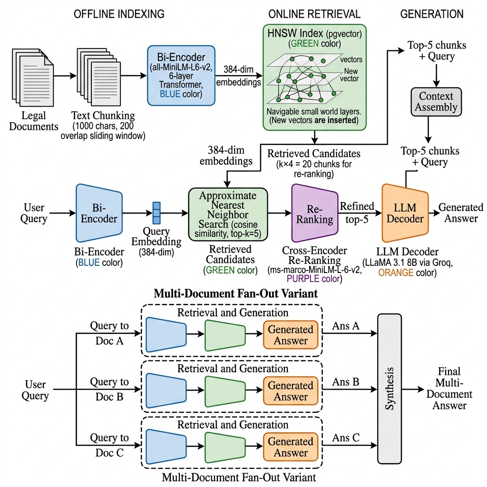
*Fig. 11. Complete Synapse RAG pipeline showing the three phases: (1) Offline indexing—documents are chunked, embedded via the bi-encoder, and stored in an HNSW index; (2) Online retrieval—queries are embedded, matched via ANN search, and re-ranked via the cross-encoder; (3) Generation—top-k passages are assembled as context for the decoder LLM.*

## Appendix B: Multi-Document Fan-Out Orchestration

For cross-document comparative queries (e.g., "Which agreements have an uncapped liability clause?"), Synapse RAG employs a **fan-out** strategy:

1. **Document Discovery**: The bi-encoder identifies the top-$D$ most relevant documents by selecting the documents containing the highest-similarity chunks.
2. **Independent Retrieval**: For each of the $D$ documents, retrieve the top-$C$ chunks independently, preventing cross-contamination of contractual facts.
3. **Per-Document Generation**: The LLM generates an answer for each document independently.
4. **Synthesis**: A final synthesis step aggregates per-document answers into a structured comparison.

This isolation prevents the common failure mode of blending chunks from unrelated contracts into a single retrieval pool, which often produces incorrect cross-document conclusions.
